```{=html}
<!-- ========================================================
     01 — HERO

     Hero-Bild und Bildausschnitt werden in styles.css unter
     „04 — HERO“ festgelegt.
     ======================================================== -->
```

:::::: story-hero
::: {.story-hero__image role="img" aria-label="Historisches Klassenfoto von Schülerinnen des Mädchengymnasiums"}
:::

::: story-hero__overlay
<p class="story-kicker">

Wien, 1893–1903

</p>

# Sie waren die Ersten

<p class="story-hero__lead">

Das erste deutschsprachige Mädchengymnasium: <br> 422 Schülerinnen, zehn
Schuljahre und eine digitale Forschungskollektion<br> erzählen die
Geschichte einer bildungspolitischen Revolution.

</p>
:::

<details class="image-info image-info--hero">

<summary aria-label="Bildnachweis anzeigen">

i

</summary>

::: {}
<strong>Bild:</strong> Mädchengymnasium - Klassenfoto des 1. Jahrgangs,
ca. 1893<br> <strong>Quelle:</strong> Mit freundlicher Genehmigung von
Wolfgang Kraus, Nachlass Margarete Müller (verh. Kraus), Familienarchiv
Kraus; Digitalisat: https://phaidra.univie.ac.at/o:2342434 <br>
<strong>Lizenz:</strong>
<a href=" https://creativecommons.org/publicdomain/mark/1.0/"
   target="_blank"
   rel="noopener noreferrer"
   style="color:#F2F2F2;"> Public Domain Mark 1.0 </a>
:::

</details>
::::::

```{=html}
<!-- ========================================================
     02 — HERAUSFORDERUNG
     ======================================================== -->
```

:::::: {#challenge .story-section}
## Eine bildungspolitische Revolution

Marianne Hainisch, die Pionierin der österreichischen
bürgerlich-liberalen Frauenbewegung, sagt über die Stellung der Frau im
19. Jahrhundert:

> [<strong>**„ ... uns fehlten alle staatsbürgerlichen Rechte.** <br>
> **Kurz, die Frauen waren in allem und jedem
> rechtlos.**“<br></strong>]{style="font-size: 1.3em;"} Marianne
> Hainisch. 1930. Zur Geschichte der österreichischen Frauenbewegung.
> <br>In: Frauenbewegung, Frauenbildung und Frauenarbeit in Österreich.

Das erste deutschsprachige Mädchengymnasium – die Gymnasiale
Mädchenschule – eröffnete jungen Frauen erstmals Bildungswege, die ihnen
zuvor verschlossen waren. Die Geschichte ihrer Pionierinnen ist in
Schulkatalogen, Archiven und verstreuten biografischen Fundstücken
erhalten.<br>

Folgen wir gemeinsam den Spuren von 422 Schulmädchen, deren Mut und
Einsatz das österreichische Bildungswesen für immer veränderten. Sie
lieferten den entscheidenden empirischen Beweis, dass Mädchen ihren
Brüdern intellektuell ebenbürtig waren.

Wer waren diese Mädchen und jungen Frauen, auf deren Schultern dieses
gesellschaftliche Experiment lastete? Woher kamen diese Pionierinnen,
ohne die diese Reform nicht gelungen wäre? <br>

::::: story-figure
:::: image-frame
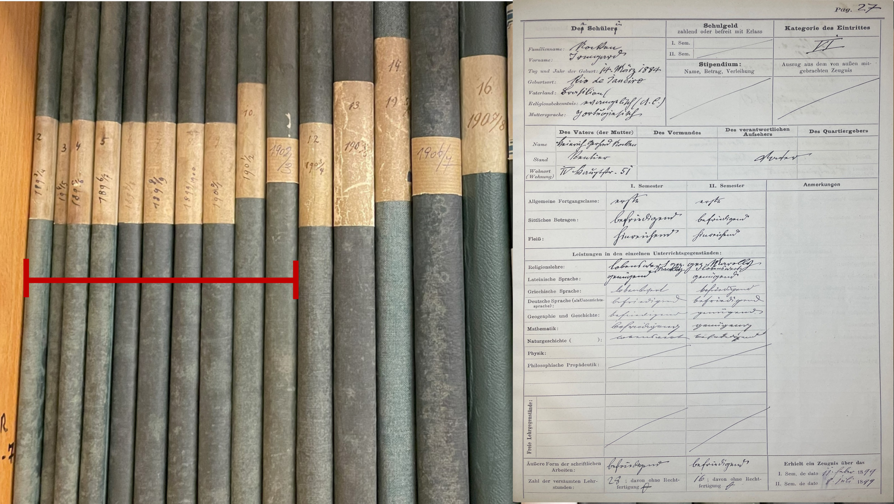{fig-alt="Der Blick ins Archiv des Mädchengymnasiums mit den Schulkatalogen, eine Seite daraus wird gezeigt"
loading="lazy"}

<details class="image-info">

<summary aria-label="Bildnachweis anzeigen">

i

</summary>

::: {}
<strong>Bild:</strong> Blick ins Archiv: Die Schulkataloge und eine
Seite daraus<br> <strong>Quelle:</strong> Photo und Digitalisat von Ruth
Pfosser<br> <strong>Lizenz:</strong>
<a href=" https://creativecommons.org/publicdomain/mark/1.0/"
   target="_blank"
   rel="noopener noreferrer"
   style="color:#F2F2F2;"> Public Domain Mark 1.0 </a>
:::

</details>
::::

<p class="figure-caption">

Blick ins Archiv des Mädchengymnasiums mit den Schulkatalogen. Band 2-11
sind Gegenstand dieser Studie (Band 1 ist zur Zeit nicht auffindbar).
Eine digitalisierte Seite mit der Beschreibung einer Schülerin zeigt das
Formular und die Daten, die in den Schulkatalogen erfasst wurden.

</p>
:::::
::::::

```{=html}
<!-- ========================================================
     03 — QUELLEN

     Die Callouts sind flexible Behälter. Sie können Text,
     Bilder, Tabellen, Statistik oder Dataviz enthalten.
     ======================================================== -->
```

:::::::::: {#sources .story-section}
## Die Schulkataloge

Zehn Bücher, die jeweils alle Klassen eines Schuljahres zusammenfassen,
dokumentieren auf 1209 Katalogseiten insgesamt 422 Schülerinnen, ihren
Geburtsort und -datum, Muttersprache und Religionszugehörigkeit sowie
die Berufe ihrer Väter (selten: Mütter), Wohnadressen und ihre
schulische Laufbahn.

::::: {.callout-note .callout-evidence collapse="true"}
## Originalquelle ansehen

Ein Detailausschnitt aus der Katalogseite für Irmgard Nocken.<br> Wie
gut können Sie den handschriftlichen Text lesen?<br><br> Nicht immer ist
das Entziffern alter Handschriften einfach. Aber es gibt Hilfe,
probieren Sie es aus!<br>

- <a href="https://gonline.univie.ac.at/erste-schritte-in-kurrent"
   target="_blank"
   rel="noopener noreferrer"> <strong>Erste Schritte in
  Kurrent</strong></a> <br>
- <a href="https://www.adfontes.uzh.ch/"
   target="_blank"
   rel="noopener noreferrer"> <strong>Ad Fontes - Zu den
  Quellen</strong></a>

:::: image-frame
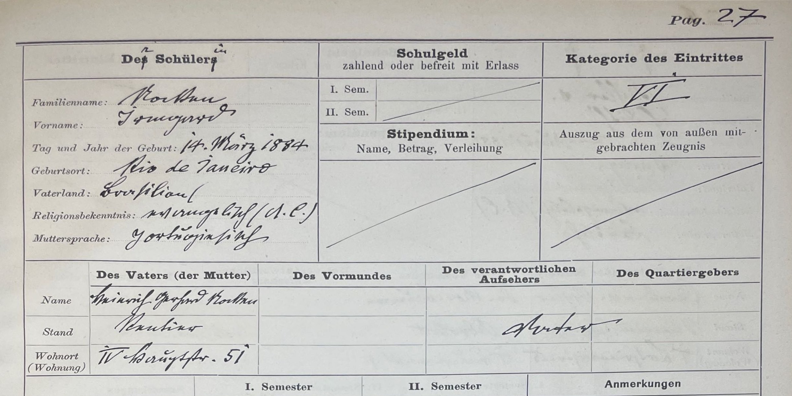{fig-alt="Ausschnitt aus dem Schulkatalog von Irmgard Nocken"
width="100%" loading="lazy"}

<details class="image-info">

<summary aria-label="Bildnachweis anzeigen">

i

</summary>

::: {}
<strong>Bild:</strong> Detail aus dem Schulkatalog<br>
<strong>Quelle:</strong> Archiv Rahlgasse 4, Digitalisate:
https://osf.io/s6u2t/overview<br> <strong>Lizenz:</strong>
<a href=" https://creativecommons.org/publicdomain/mark/1.0/"
   target="_blank"
   rel="noopener noreferrer"
   style="color:#F2F2F2;"> Public Domain Mark 1.0 </a>
:::

</details>
::::

Alle digitalisierten Schulkataloge sind unter der Public Domain Mark zur
freien Verwendung auch hier abgespeichert:
<a href="https://phaidra.univie.ac.at/detail/o:2169453" 
target="_blank" 
rel="noopener noreferrer"><strong> Schulkataloge
(Digitalisate)</strong></a>

Zur Suche nach Namen, Geburtsdatum oder Geburtsorten steht eine
interaktive Datentabelle zur Verfügung:
<a href="https://phaidra.univie.ac.at/detail/o:2170132" 
target="_blank" 
rel="noopener noreferrer"><strong> Datentabelle Mädchengymnasium (Wien,
1893-1903)</strong></a>
:::::

::: {.callout-note .callout-method collapse="true"}
## Von der Quelle zur Information

Die Transkription ist aber nur der erste Schritte, die Daten müssen
nicht nur entziffert, sondern auch als strukturierte Informationen in
einer Datenbank gespeichert werden. So können die Informationen weiter
verarbeitet und schließlich analysiert werden.

| Historischer Eintrag | Strukturierte Information |
|------------------------------|------------------------------------------|
| Geburtsort | Verknüpfung mit Normdaten (GeoNames, TGN), Geo-Koordinaten |
| Namen | Verknüpfung mit Normdaten (GND, Wikidata) und biographischen Datenbanken |
| Muttersprache | harmonisierte Bezeichnungen (böhmisch -\> tschechisch) |
| Wohnadresse | Straße, Bezirk, Geo-Koordinaten |
| Berufe (der Väter) | Einteilung in Sektoren (Forschung-Bildung, Private, Verwaltung-Administration, etc.) |
| Konfession | harmonisierte Bezeichnungen (mosaisch, israelitisch, jüdisch -\> jüdisch) |
:::

::::: {.callout-note .callout-explore collapse="true"}
## Material weiter erkunden

Die 422 Schülerinnen der ersten Dekade des ersten deutschsprachigen
Mädchengymnasiums wurden in einem Gebiet geboren, das von Den Haag im
Norden bis nach Makarska im Süden reicht, und von Rio de Janeiro im
Westen und von Tblisi im Osten begrenzt wird.<br> Die Karte zeigt die
Geburtsorte, die Farben der Markierungen zeigen die
Religionsbekenntnisse, die bei Eintritt in die Schule angegeben wurden.
Informationen zu den einzelnen Schülerinnen erscheinen durch Anklicken.

Es ist jeweils nur der Geburtsort angegeben, für die Mädchen die in Wien
geboren sind entsteht daraus eine ungeordnete Zusammenballung von
Markierungen, da die Daten für eine kleinteiligere räumliche Zuordnung
fehlen. Die interaktive Karte ist für die Nutzung auf einem größeren
Bildschirm optimiert.

:::: {.lazy-embed .lazy-embed--wide data-embed-url="https://rp082024.github.io/Maedchengymnasium_BirthplaceMap/"}


::: lazy-embed__actions
<a class="story-button"
   href="https://rp082024.github.io/Maedchengymnasium_BirthplaceMap/"
   target="_blank"
   rel="noopener noreferrer"> Interaktive Anwendung öffnen </a>
:::
::::
:::::
::::::::::

```{=html}
<!-- ========================================================
     04 — VON DOKUMENTEN ZU DATEN
     ======================================================== -->
```

::::::: {#modelling .story-section}
## Wie aus Archivquellen historische Erkenntnisse entstehen

Die Informationen werden nicht nur gesammelt, sondern miteinander
verknüpft. Dadurch werden Zusammenhänge sichtbar, die in den einzelnen
Schulkatalogen verborgen bleiben.

Aus hunderten einzelner Beobachtungen wächst Schritt für Schritt eine
digitale Forschungssammlung, die nicht nur durchsucht und analysiert,
sondern auch von anderen weiter erforscht, ergänzt und genutzt werden
kann.

::: process-line
**HISTORISCHE QUELLE → DATEN ERFASSEN → STRUKTURIEREN → ANREICHERN →
ANALYSIEREN → EINORDNEN**
:::

Die 1209 Seiten der historischen Schulkataloge von 1893–1903 des ersten
deutschsprachigen Mädchengymnasiums bilden die Grundlage dieser
Untersuchung. Jede Seite enthält handschriftliche Einträge zu einer
bestimmten Schülerin.

Durch die Transkription werden diese Angaben zunächst les- und
bearbeitbar gemacht. Beim Strukturieren, Normalisieren und Harmonisieren
werden sie so aufbereitet, dass gleichartige Angaben gemeinsam
ausgewertet werden können.

Dabei werden bereits Forschungsentscheidungen getroffen: Welche Angaben
werden erfasst? Wie werden sie gegliedert? Welche Schreibweisen werden
vereinheitlicht? Welche Kategorien werden gebildet? Die Forschungsdaten
sind deshalb keine neutralen Abbilder der Quellen, sondern das Ergebnis
nachvollziehbarer Bearbeitungsschritte.

Beim Anreichern werden weitere Informationen ergänzt und miteinander
verknüpft – etwa zu Personen, Orten, Berufen oder anderen historischen
Quellen und Datenbanken.

Durch Analyse und Vergleich werden schließlich Muster sichtbar: Woher
kamen die Schülerinnen? Wo wohnten sie? Welche Gemeinsamkeiten oder
Unterschiede zeigen sich?

Doch ein Muster ist noch keine historische Erklärung. Erst durch die
Rückkehr zu den Quellen, durch weitere Recherchen und die Einordnung in
den historischen Kontext lässt sich verstehen, was hinter einer
Beobachtung steckt.

::::: {.callout-note .callout-method collapse="true"}
## Historische Spurensuche

Historische Quellen sind nicht immer eindeutig. Straßennamen ändern
sich, Handschriften sind schwer lesbar und manchmal fehlen Informationen
ganz. Oft müssen verschiedene Quellen miteinander verglichen werden, um
eine Frage beantworten zu können – manchmal bleibt sie auch offen.

<figure>

:::: image-frame
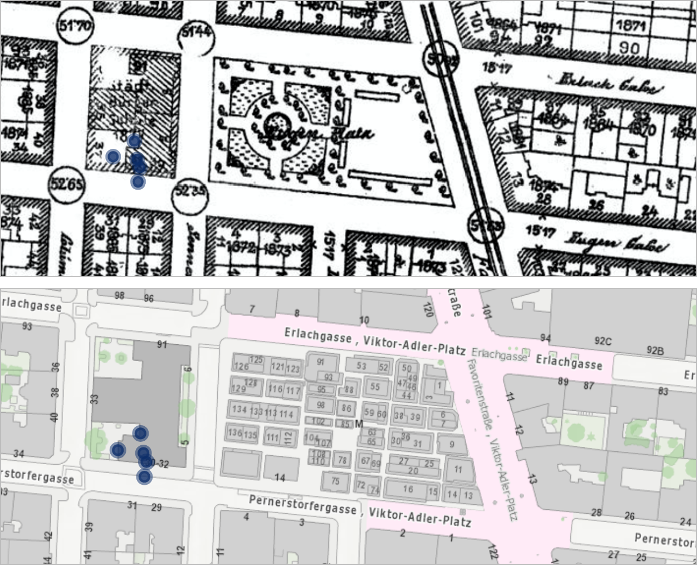{fig-alt="Zwei Kartenausschnitte aus verschiedenen Jahren zeigen unterschiedliche Straßennamen"
loading="lazy"}

<details class="image-info">

<summary aria-label="Bildnachweis anzeigen">

i

</summary>

::: {}
<strong>Quelle & Lizenz Generalstadtplan 1904: </strong>Wiener Stadt-
und Landesarchiv (MA 8), bereitgestellt über Wien Kulturgut / ViennaGIS,
Historisches Original: gemeinfrei <br> <strong>Quelle & Lizenz Stadtplan
Wien 2026: </strong>Stadt Wien – data.wien.gv.at,
<a href="https://creativecommons.org/licenses/by/4.0/deed.en"
   target="_blank"
   rel="noopener noreferrer"
   style="color:#F2F2F2;"> CC BY 4.0 </a>
:::

</details>
::::

<figcaption>Generalstadtplan 1904 (oben) & Stadtplan Wien 2026
(unten)</figcaption>

</figure>

Der Schulkatalog einer Schülerin zeigt als Wohnort die Eugengasse in
Wien Favoriten. Mithilfe [historischer
Stadtpläne](https://www.wien.gv.at/kultur/kulturgut-plaene){target="_blank"}
und des [Wien Geschichte
Wiki](https://www.geschichtewiki.wien.gv.at/Wien_Geschichte_Wiki){target="_blank"}
ließ sich ihr Wohnort als die heutige Pernerstorfergasse identifizieren.

Aber da ist schon das nächste Problem: das Haus an der angegebenen
Adresse war damals und ist heute ein Schulgebäude! Das kann doch nicht
stimmen – oder doch? <br>

Des Rätsels Lösung: Bis 1907 war es üblich, daß die Schuldirektoren mit
ihren Familien in der Schule wohnten. Die Schülerin am Mädchengymnasium
war also die Tochter eines Schuldirektors in Favoriten.
:::::
:::::::

```{=html}
<!-- ========================================================
     05 — ERGEBNISSE

     Karten können ergänzt, verschoben oder gelöscht werden.
     ======================================================== -->
```

:::::::::::::::::::::: {#findings .story-section}
## Was die Daten zeigen

Bei der Einschulung gab mehr als die Hälfte der Schülerinnen die
Zugehörigkeit zum römisch-katholischen Glauben bekannt. Für ungefähr ein
Drittel wurde als Konfession "jüdisch" eingetragen.

Die Berufsangaben zu Eltern und Vormundspersonen ermöglichen eine
Annäherung an den sozialen Hintergrund der Schülerinnen. Beinahe die
Hälfte der Schülerinnen stammte aus Familien der drei größten
Berufsbereiche: Kaufleute und Unternehmer (23 %), Forschung und Bildung
(13,5 %) sowie Privat-Beamte, heute Angestellte genannt (10,2 %).
Besonders stark vertreten waren damit kaufmännisch-unternehmerische und
bildungsbezogene Berufe.

Die historischen Wohnadressen wurden den heutigen Wiener Bezirken
zugeordnet. Mehr als die Hälfte der erfassten Wohnadressen (56,8 %)
konzentrierte sich auf nur fünf Bezirke: den 1., 2., 3., 4. und 9.
Bezirk. Besonders stark vertreten waren der 1. und 9. Bezirk mit 14,8
bzw. 13,3 %. Insgesamt lagen 73,8 % der Adressen der Schülerinnen
innerhalb der heutigen Bezirke 1–9, 23,9 % in den äußeren Wiener
Bezirken (10–23) und 2,1 % außerhalb Wiens (und hier insbesondere in
Orten entlang von Bahnverbindungen).

:::::::::::: finding-grid
::::: finding-card
### Religion

<figure>

:::: image-frame
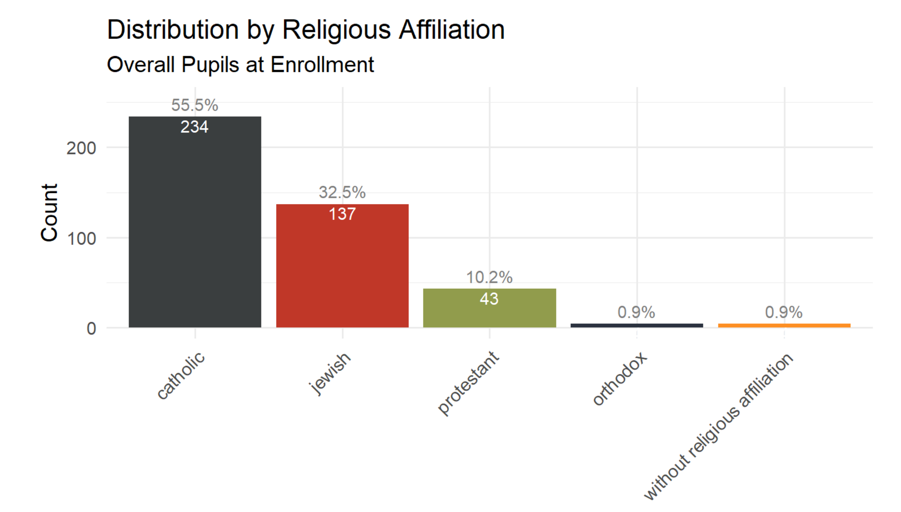{fig-alt="Religionszugehörigkeit der 422  Gymnasiastinnen"
loading="lazy"}

<details class="image-info">

<summary aria-label="Bildnachweis anzeigen">

i

</summary>

::: {}
<strong>Quelle:</strong> Master Thesis: Pfosser, Ruth. (2026). They Were
The First.<br> <strong>Lizenz: </strong>
<a href="https://creativecommons.org/licenses/by/4.0/deed.en"
   target="_blank"
   rel="noopener noreferrer"
   style="color:#F2F2F2;"> CC BY 4.0 </a>
:::

</details>
::::

<figcaption>Die Religionszugehörigkeit der 422 Schülerinnen des ersten
deutschsprachigen Mädchengymnasiums (Wien, 1893-1903)</figcaption>

</figure>
:::::

::::: finding-card
### Familien

<figure>

:::: image-frame
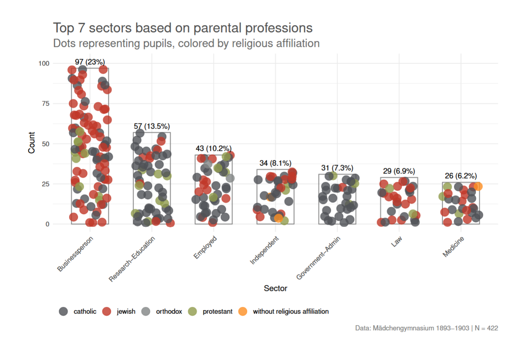{fig-alt="Der berufliche Background der Familien aus denen die Gymnasiastinnen stammten"
loading="lazy"}

<details class="image-info">

<summary aria-label="Bildnachweis anzeigen">

i

</summary>

::: {}
<strong>Quelle:</strong> Master Thesis: Pfosser, Ruth. (2026). They Were
The First.<br> <strong>Lizenz: </strong>
<a href="https://creativecommons.org/licenses/by/4.0/deed.en"
   target="_blank"
   rel="noopener noreferrer"
   style="color:#F2F2F2;"> CC BY 4.0 </a>
:::

</details>
::::

<figcaption>Der berufliche Background der Familien aus denen die
Gymnasiastinnen stammten (Wien, 1893-1903)</figcaption>

</figure>
:::::

::::: finding-card
### Stadtraum

<figure>

:::: image-frame
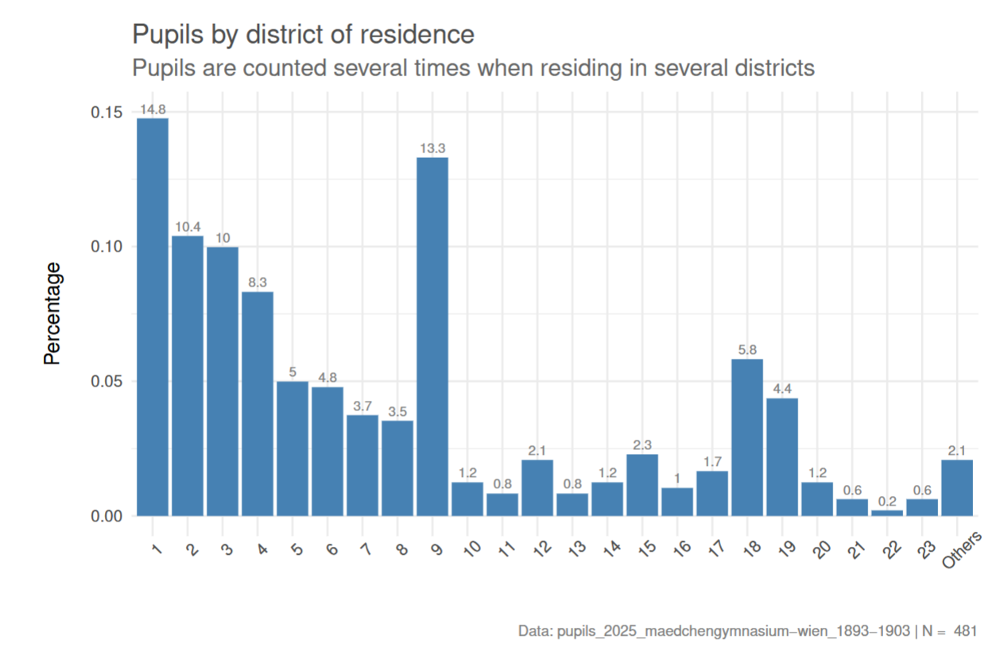{fig-alt="Die Wohnadressen der Schülerinnen in den Wiener Bezirken"
loading="lazy"}

<details class="image-info">

<summary aria-label="Bildnachweis anzeigen">

i

</summary>

::: {}
<strong>Quelle:</strong> Master Thesis: Pfosser, Ruth. (2026). They Were
The First.<br> <strong>Lizenz: </strong>
<a href="https://creativecommons.org/licenses/by/4.0/deed.en"
   target="_blank"
   rel="noopener noreferrer"
   style="color:#F2F2F2;"> CC BY 4.0 </a>
:::

</details>
::::

<figcaption>Die Wohnbezirke der Gymnasiastinnen (Mädchengymnasium, Wien,
1893-1903)</figcaption>

</figure>
:::::
::::::::::::

<br>

> [<strong>Aber was genau bedeutet
> das?<br></strong>]{style="font-size: 1.3em;"}

::::: {.callout-note .callout-evidence collapse="true"}
## Religion

Im Vergleich zur Wiener Stadtbevölkerung war der Anteil jüdischer
Schülerinnen am Mädchengymnasium fast viermal so hoch. Mädchen aus
jüdischen Familien trugen überproportional dazu bei, den Zugang von
Frauen zu höherer Bildung und Universitätsstudium zu erkämpfen.

:::: image-frame
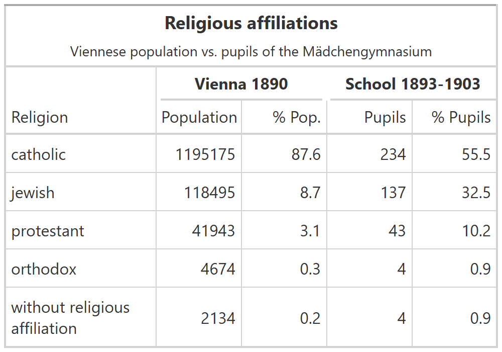{fig-alt="Religionszugehörigkeit der Wr. Bevölkerung im Vergleich mit Schülerinnen des Mädchengymnasiums."
loading="lazy"}

<details class="image-info">

<summary aria-label="Bildnachweis anzeigen">

i

</summary>

::: {}
<strong>Quelle:</strong> Master Thesis: Pfosser, Ruth. (2026). They Were
The First.<br> <strong>Lizenz: </strong>
<a href="https://creativecommons.org/licenses/by/4.0/deed.en"
   target="_blank"
   rel="noopener noreferrer"
   style="color:#F2F2F2;"> CC BY 4.0 </a>
:::

</details>
::::

<figcaption>Religionszugehörigkeit der Wr. Bevölkerung im Vergleich mit
Schülerinnen des Mädchengymnasiums.
<a href="https://www.digital.wienbibliothek.at/wbrobv/periodical/titleinfo/2157586"
   target="_blank"
   rel="noopener noreferrer"> Quelle Wienbibliothek im Rathaus:
</a>Volkszählung 1890. In: Statistisches Jahrbuch der Stadt Wien für das
Jahr 1892. S. 37f;</figcaption>
:::::

::::: {.callout-note .callout-evidence collapse="true"}
## Familien

Die Grafik zeigt nicht nur die Zugehörigkeit der Väter, selten Mütter
oder Vormünder, zu bestimmten Berufsgruppen und Tätigkeitsfeldern,
sondern auch ihre Religionszugehörigkeit. Damit wird deutlich welche
Tätigkeitsfelder in der Regel katholischen Personen vorbehalten waren
(Beamte im Bereich Forschung & Bildung und in der öffentlichen
Verwaltung) und welche auch Personen jüdischen Glaubens offen standen
(selbstständige Kaufleute, Ärzte und Anwälte).

Die statistische Analyse macht damit sichtbar, wie ungleich berufliche
und gesellschaftliche Handlungsspielräume in Wien um 1900 nach
Geschlecht, Religionszugehörigkeit und sozialer Herkunft verteilt waren.

:::: image-frame
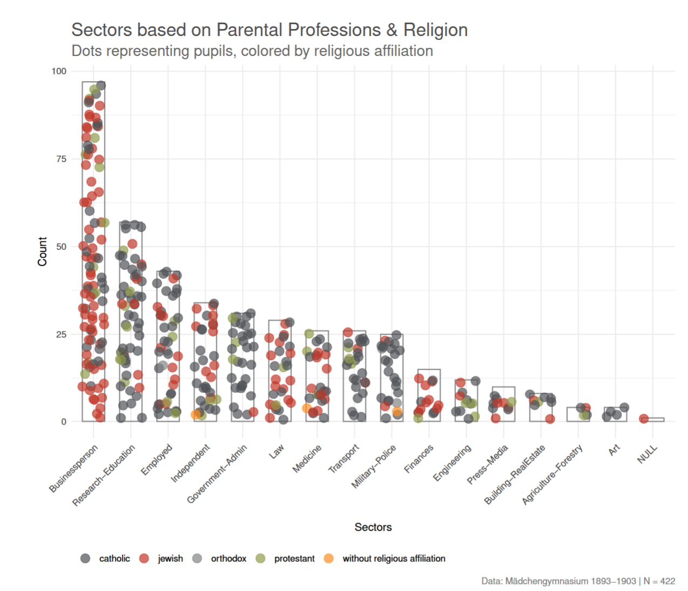{fig-alt="Elterliche Berufe und Religionszugehörigkeit"
loading="lazy"}

<details class="image-info">

<summary aria-label="Bildnachweis anzeigen">

i

</summary>

::: {}
<strong>Quelle:</strong> Master Thesis: Pfosser, Ruth. (2026). They Were
The First.<br> <strong>Lizenz: </strong>
<a href="https://creativecommons.org/licenses/by/4.0/deed.en"
   target="_blank"
   rel="noopener noreferrer"
   style="color:#F2F2F2;"> CC BY 4.0 </a>
:::

</details>
::::

<figcaption>Elterliche Berufe und Religionszugehörigkeit</figcaption>
:::::

::::: {.callout-note .callout-evidence collapse="true"}
## Stadtraum

Die räumliche Verteilung der Wohnadressen wurde mit der
Religionszugehörigkeit verknüpft und farblich codiert. Dabei werden
räumliche Muster sichtbar: In manchen Bezirken überwiegt unter den
Herkunftsfamilien der Gymnasiastinnen eine Religionszugehörigkeit
deutlich – im 3. Bezirk die katholische, im 2. Bezirk die jüdische –,
während etwa der 4. Bezirk stärker durchmischt erscheint.

Auffallend sind auch die Grenzen der damaligen Wiener Bebauung: Der
heutige 21. Bezirk ist bereits parzelliert, aber noch kaum bebaut.

:::: image-frame
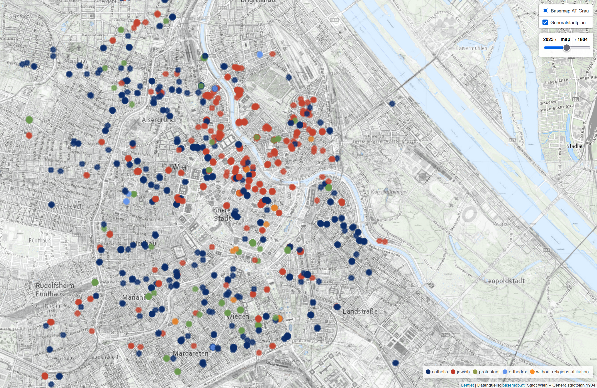{fig-alt="Wohnadressen der Gymnasiastinnen und die religiöse Zugehörigkeit"
loading="lazy"}

<details class="image-info">

<summary aria-label="Bildnachweis anzeigen">

i

</summary>

::: {}
<strong>Quelle:</strong> Master Thesis: Pfosser, Ruth. (2026). They Were
The First.<br> <strong>Lizenz: </strong>
<a href="https://creativecommons.org/licenses/by/4.0/deed.en"
   target="_blank"
   rel="noopener noreferrer"
   style="color:#F2F2F2;"> CC BY 4.0 </a>
:::

</details>
::::

<figcaption>Die Wohnadressen und Religionszugehörigkeit der Familien der
Schülerinnen des Mädchengymnasiums<br> Die interaktive Anwendung dazu
(für die Nutzung auf einem größeren Bildschirm
optimiert)<a href="https://rp082024.github.io/Maedchengymnasium_VienneseAdresses/"
   target="_blank"
   rel="noopener noreferrer"> Die Wiener Adressen der Gymnasiastinnen
(1893-1903) </a></figcaption>
:::::
::::::::::::::::::::::

```{=html}
<!-- ========================================================
     06 — INTERAKTIVE ANWENDUNG

     Der gleiche Block funktioniert für Leaflet, DataTable,
     Shiny und andere Anwendungen mit fixer URL.

     lazy-embed--wide = nahezu ganze Seitenbreite
     lazy-embed--reading = normale Lesebreite
     ======================================================== -->
```

::::: {#interactive .story-section}
## Die Daten interaktiv erkunden

Möchten Sie die Daten forschend genauer erkunden? Der Data Explorer
unterstützt Sie dabei und zeigt eine Datentabelle, die Karte der Wiener
Wohnorte und die digitalisierten Schulkataloge in verknüpfter Ansicht.
So können alle Interessierten ihrer eigenen Suchstrategie folgen und
dabei anhand der Quellen weitere Details erschließen.

Die Anwendung wird erst nach einem Klick geladen. Dadurch bleibt die
Seite beim ersten Öffnen schnell und stabil. Der interaktive Data
Explorer ist für die Nutzung auf einem größeren Bildschirm optimiert.

:::: {.lazy-embed .lazy-embed--wide}
```{=html}
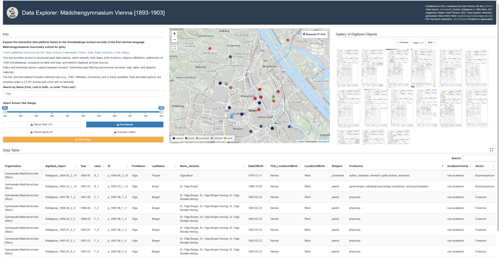
```

::: lazy-embed__actions
<a class="load-embed"
   href="https://6mb6sz-ruth-pfosser.shinyapps.io/DataExplorer_WMS_Shiny_2025/"
   target="_blank"
   rel="noopener noreferrer"> Interaktive Anwendung öffnen </a>
:::
::::
:::::

```{=html}
<!-- ========================================================
     07 — BIOGRAFIE UND QUELLENLEISTE

     Ein weiteres <figure> kopieren, um eine Quelle zu ergänzen.
     Auf kleinen Bildschirmen horizontal wischen.
     ======================================================== -->
```

::::::::::::::::::: {#people .story-section}
## Eine Biografie aus verstreuten Spuren

Aggregierte Muster führen zurück zu individuellen Lebenswegen. Die
Bildleiste zeigt, wie eine Biografie aus unterschiedlichen Quellen
rekonstruiert werden kann.

::::::::::::::::: {.source-rail aria-label="Quellen zu einer Biografie"}
<figure>

:::: image-frame
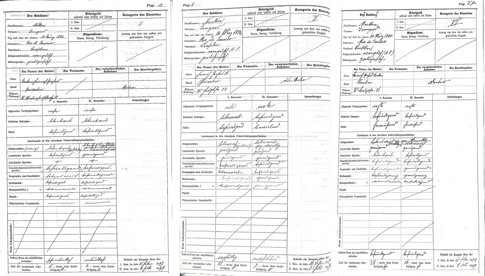{fig-alt="Drei Schulkataloge"
loading="lazy"}

<details class="image-info">

<summary aria-label="Bildnachweis anzeigen">

i

</summary>

::: {}
<strong>Quelle:</strong> Pfosser, Ruth. 2025. Schulkataloge
(Digitalisate) <a href="https://osf.io/s6u2t/overview"
   target="_blank"
   rel="noopener noreferrer"
   style="color:#F2F2F2;"> osf.io/s6u2t</a><br> <strong>Lizenz:</strong>
<a href=" https://creativecommons.org/publicdomain/mark/1.0/"
   target="_blank"
   rel="noopener noreferrer"
   style="color:#F2F2F2;"> Public Domain Mark 1.0 </a>
:::

</details>
::::

<figcaption>Schulkataloge, 1896/97, 1897/98, 1898/99.</figcaption>

</figure>

<figure>

:::: image-frame
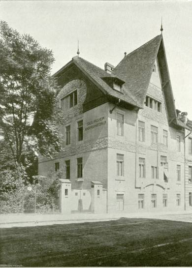{fig-alt="Foto Kinderheim | St. Veit-Gasse 59 ca. 1904"
loading="lazy"}

<details class="image-info">

<summary aria-label="Bildnachweis anzeigen">

i

</summary>

::: {}
<strong>Quelle:</strong> Wienbibliothek im Rathaus, D-76617: Der
Architekt, September 1904, Tafel 97 <br> <strong>Lizenz: </strong>
<a href="https://creativecommons.org/licenses/by-nc-nd/4.0/deed.en"
   target="_blank"
   rel="noopener noreferrer"
   style="color:#F2F2F2;"> CC BY-NC-ND 4.0 </a>
:::

</details>
::::

<figcaption>Das Haus in der St.-Veit-Gasse 59 wird fertiggestellt
(1903/1904)</figcaption>

</figure>

<figure>

:::: image-frame
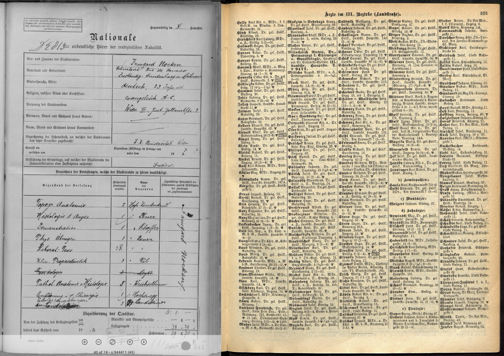{fig-alt="1907 Nationale (Inskriptionsverzeichnis) Universität Wien, 1911 Adressverzeichnis Lehmann"
loading="lazy"}

<details class="image-info">

<summary aria-label="Bildnachweis anzeigen">

i

</summary>

::: {}
<strong>Nationale.</strong> Quelle:
<a href="https://phaidra.univie.ac.at/o:944365" 
   target="_blank"
   rel="noopener noreferrer"
   style="color:#F2F2F2;">Inskriptionsscheine 1907</a>Lizenz:
<a href="https://creativecommons.org/licenses/by-nc-nd/4.0/"
   target="_blank"
   rel="noopener noreferrer"
   style="color:#F2F2F2;"> CC BY-NC-ND 4.0</a> <strong>Lehmanns
Adressbücher.</strong> Quelle:
<a href="https://digital.wienbibliothek.at/wbrobv/periodical/titleinfo/2525138" 
   target="_blank"
   rel="noopener noreferrer"
   style="color:#F2F2F2;"> Wienbibliothek im Rathaus </a>Lizenz:
<a href="https://creativecommons.org/publicdomain/mark/1.0/deed.de"
   target="_blank"
   rel="noopener noreferrer"
   style="color:#F2F2F2;"> Public Domain Mark 1.0</a>
:::

</details>
::::

<figcaption>Wohnung 3. Bez. Hint. Zollamtsstr. 3 (1907 Inskription, 1911
Lehmann)</figcaption>

</figure>

<figure>

:::: image-frame
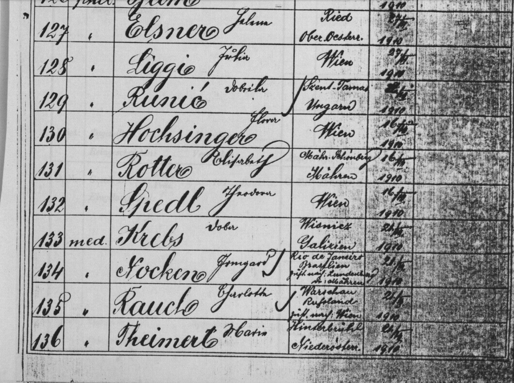{fig-alt="Verzeichnis promovierter Frauen"
loading="lazy"}

<details class="image-info">

<summary aria-label="Bildnachweis anzeigen">

i

</summary>

::: {}
<strong>Quelle: </strong>Archiv der Universität Wien\
<a href="https://phaidra.univie.ac.at/detail/o:104996" 
   target="_blank"
   rel="noopener noreferrer"
   style="color:#F2F2F2;"> Signatur: M 36 </a><br> <strong>Lizenz:
</strong>
<a href="https://creativecommons.org/licenses/by-nc/2.0/at/deed.de"
   target="_blank"
   rel="noopener noreferrer"
   style="color:#F2F2F2;"> CC BY-NC 2.0 AT </a>
:::

</details>
::::

<figcaption>Verzeichnis promovierter Frauen an der Universität Wien,
1897-1923</figcaption>

</figure>

<figure>

:::: image-frame
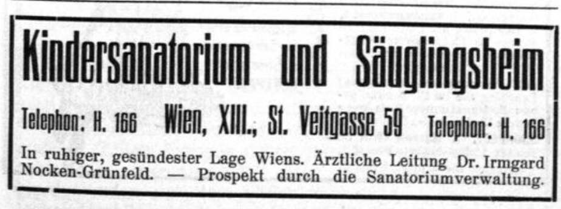{fig-alt="Historische Zeitungsanzeige"
loading="lazy"}

<details class="image-info">

<summary aria-label="Bildnachweis anzeigen">

i

</summary>

::: {}
<strong>Quelle:</strong> Deutsch-Englischer-Reise-Courier, 1914, Nr. 2,
S. 3
<a href="https://anno.onb.ac.at/cgi-content/anno-plus?aid=der&datum=1914&page=45&size=45&qid=VW2BJTO5192HC92170ABYI38EYJUMW" 
   target="_blank"
   rel="noopener noreferrer"
   style="color:#F2F2F2;"> ÖNB-ANNO </a><br> <strong>Lizenz:</strong>
Das Original ist gemeinfrei, das Digitalisat zur Nachnutzung freigegeben
:::

</details>
::::

<figcaption>Zeitungsannonce für das Kinderheim, 1914.</figcaption>

</figure>

<figure>

:::: image-frame
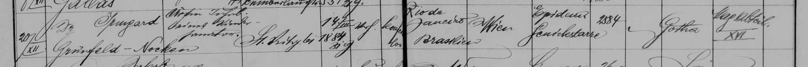{fig-alt="Totenbeschauprotokoll"
loading="lazy"}

<details class="image-info">

<summary aria-label="Bildnachweis anzeigen">

i

</summary>

::: {}
<strong>Quelle: </strong>WStLA www.wais.wien.at; AT-WSTLA 1.1.10.B1.967;
Totenbeschauprotokolle <br> <strong>Lizenz: </strong>
<a href="https://creativecommons.org/licenses/by-nc-nd/4.0/deed.de"
   target="_blank"
   rel="noopener noreferrer"
   style="color:#F2F2F2;"> CC BY-NC-ND 4.0 </a>
:::

</details>
::::

<figcaption>Totenbeschauprotokoll \[1915\] im Sterberegister der
Gemeinde Wien.</figcaption>

</figure>

<figure>

:::: image-frame
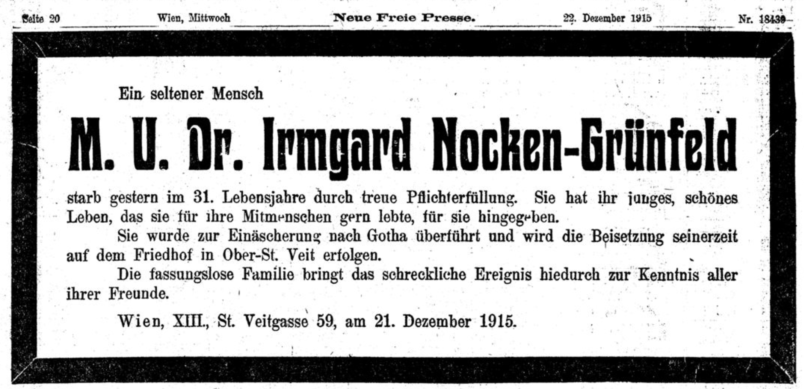{fig-alt="Nocken Todesanzeige"
loading="lazy"}

<details class="image-info">

<summary aria-label="Bildnachweis anzeigen">

i

</summary>

::: {}
<strong>Quelle:</strong> Neue Freie Presse, 1915-12-22, Seite 20\
<a href="https://anno.onb.ac.at/cgi-content/anno?aid=nfp&datum=19151222&seite=20&zoom=33&query=%22Irmgard%2BNocken%22&ref=anno-search" 
   target="_blank"
   rel="noopener noreferrer"
   style="color:#F2F2F2;"> ÖNB-ANNO </a><br> <strong>Lizenz:</strong>
Das Original ist gemeinfrei, das Digitalisat zur Nachnutzung freigegeben
:::

</details>
::::

<figcaption>Die Todesnachricht in der *Neue Freie Presse*.</figcaption>

</figure>
:::::::::::::::::

::: {.callout-note .callout-evidence collapse="true"}
## Biografie Irmgard Nocken

Die Schulkataloge liefern uns die **Basisdaten**: Irmgard Nocken,
geboren am 14. März 1884 in Rio de Janeiro, Brasilien.
Religionsbekenntnis: evangelisch, Muttersprache: portugiesisch. Vater:
Heinrich Nocken, Privatier. Wohnung: IV. Bezirk, (Wiedner) Hauptstr. 51.

1896 tritt sie nach bestandener **Aufnahmeprüfung** (Schulkatalog,
Kategorie des Eintrittes: I) in die erste Klasse des Mädchengymnasiums
ein – ein bemerkenswerter Schritt für eine Zwölfjährige aus Brasilien
ohne deutsche Muttersprache. 1897/98 steigt sie in die zweite Klasse auf
(Schulkatalog, Kategorie des Eintrittes: II), wiederholt diese jedoch
freiwillig im folgenden Jahr (Schulkatalog, Kategorie des Eintrittes:
VI). Eine Besonderheit der Schulkataloge dieser Klasse ist der neue
Klassenvorstand, der die vorgedruckten Formulare durchwegs korrigiert
und konsequent **geschlechtergerechte Sprache** verwendet: „der
Schülerin“ statt „des Schülers“. - Ein erster Schritt hin zu mehr
Sichtbarkeit von Mädchen? Oder einfach nur sprachliche Korrektheit?

Danach verliert sich Irmgard Nockens Spur in den Schulkatalogen; sie
verließ die Schule offenbar nach drei Jahren. War sie erst vor Kurzem
nach Wien gekommen? Waren die sprachlichen Defizite noch zu groß? Hat
sie die Schulerfahrung als Scheitern erlebt? Hat Irmgard Nocken ihre
Träume von Matura und einem Universitätsstudium aufgegeben?

Sie hat wohl weiter **Privatunterricht** erhalten, denn 1904 legt die
Tochter eines mährischen Auswanderers aus Lundenburg/Breclav, der in
Brasilien vermutlich sein Glück gemacht hat, am Akademischen Gymnasium
Wien die **Matura** ab.

Im selben Jahr 1904 (1903 lt. Generalstadtplan von 1904) wird das Haus
**St.-Veit-Gasse 59** fertiggestellt, das vom Architekten Karl Stöger im
Auftrag des berühmten Kinderarztes Ernst Moro (1874-1951) als
Säuglingsheim & Kindersanatorium entworfen wurde und eine Verbindung von
Cottage-Architektur mit modernen Jugendstilformen darstellt. Dieses Haus
wird für Irmgard Nocken später noch bedeutend sein. Aber in ihrer
Studienzeit und während der ersten Jahre ihrer Berufstätigkeit ist sie
im 3. Bezirk gemeldet: **Hintere Zollamtsstraße 3**.

Nach der Matura hat Irmgard Nocken Medizin studiert, wie uns ihre
Inskriptionsscheine (Nationale) und das Verzeichnis promovierter Frauen
an der Universität Wien, 1897–1923 verraten: **Irmgard Nocken promoviert
als 134. Frau im Jahr 1910 an der Universität Wien in Medizin** (die
Rangreihung erfolgte für die philosophische und die medizinische
Fakultät gemeinsam).

1913 heiratet sie in **Ziviltrauung** (beide Partner sind jetzt
konfessionslos) Direktor Alfred Grünfeld. Im selben Jahr wird Dr.
Irmgard Nocken-Grünfeld als **ärztliche Leiterin eines Säuglingsheims
und Kindersanatoriums** genannt – zugleich ihre Wohnadresse: Das Haus
St.-Veit-Gasse 59.

1915 infiziert sie sich in Ausübung ihres Berufs mit
**Meningokokken-Meningitis** (im Totenbeschauprotokoll steht die alte
Bezeichnung „Epidemische Genickstarre“), eine Krankheit die damals kaum
behandelbar war, da Antibiotika erst ab 1950 flächendeckend verfügbar
waren. Sie stirbt im Alter von nur 31 Jahren am 20. Dezember 1915.

Ihre **Todesanzeige** vermerkt ausdrücklich die Einäscherung in Gotha.
In einer Zeit, in der sowohl gesellschaftliche Konventionen als auch die
lokalen Rahmenbedingungen eine Einäscherung verhinderten, zeugt diese
Entscheidung von einer radikal liberalen und fortschrittlichen
Grundhaltung der Verstorbenen und ihres Umfelds.

**Irmgard Nocken (1884-1915), Ärztin und *„ein seltener Mensch“*, war
eine der vielen beeindruckenden Pionierinnen der höheren Frauenbildung
in Österreich.**

QUELLEN: <br>***Schulkataloge:*** Pfosser, Ruth. (2025). Pupil Records /
Schulkataloge (digitized objects) of the first German-language
Mädchengymnasium \[Wien, 1893–1903\]. Retrieved from osf.io/s6u2t
<br>***Matura:*** [Frauen am Akademischen Gymnasium (AKG),
2023](https://akg-wien.at/wp-content/uploads/2023/09/Frauen-am-AKG.pdf)
<br>***Haus St.-Veit-Gasse 59:***
[Fotografie](https://www.geschichtewiki.wien.gv.at/St.-Veit-Gasse)
<br>***Wohnung Hintere Zollamtsstraße 3:*** <br>- 1907
Inskriptionsformular [Nationale der Studentinnen der Medizinischen
Fakultät Sommersemester 1907 A-Z](https://phaidra.univie.ac.at/o:944365)
<br>- 1911 Adressverzeichnis [Adolph Lehmann’s allgemeiner
Wohnungs‑Anzeiger: Nebst Handels‑ u. Gewerbe‑Adressbuch für d. k.k.
Reichshaupt‑ u. Residenzstadt Wien u. Umgebung.
1911.](https://digital.wienbibliothek.at/wbrobv/periodical/titleinfo/2525138)
<br>***Promotion***: <br>- Illustrierte Kronen Zeitung. 22. Juli 1910.
Weibliche Aerzte. Seite 7. Quelle: [Österreichische Nationalbibliothek –
ANNO](https://anno.onb.ac.at/cgi-content/anno?aid=krz&datum=19100722&seite=7&zoom=33&query=%22Irmgard%2BNocken%22&ref=anno-search){target="_blank"}
<br>- Neues Wiener Tagblatt. 22. Juli 1910. Promotionen weiblicher
Doktoren der Medizin. Seite 9. Quelle: [Österreichische
Nationalbibliothek –
ANNO](https://anno.onb.ac.at/cgi-content/anno?aid=nwg&datum=19100722&seite=9&zoom=33&query=%22Irmgard%2BNocken%22&ref=anno-search){target="_blank"}
<br>- Verzeichnis promovierter Frauen an der Universität Wien,
1897–1923. Universität Wien.
[Verzeichnis](https://phaidra.univie.ac.at/detail/o:104996) <br>- Archiv
der Universität Wien, [M 33.9 Promotionsprotokoll für das Doktorat der
Medizin: Bd. 9, 1904-1912
Akt](https://scopeq.cc.univie.ac.at/Query/detail.aspx?id=206091){target="_blank"}
<br>***Heirat***: Gundacker, Felix. 2025. GenTeam Datenbank
\[Genalogical {Database}\]. [GenTeam](https://www.genteam.at/de/)
<br>***Ärztliche Leiterin Kindersanatorium und Säuglingsheim:*** <br>-
Neues Frauenleben. 1913 Oktober. Liste der in Wien praktizierenden
Aerztinnen. S. 33. Quelle: [Österreichische Nationalbibliothek –
ANNO](https://anno.onb.ac.at/cgi-content/anno-plus?aid=frl&datum=1913&page=283&size=45&qid=HCOBAKLS4G4Y3IQHITRV0SQJTA1RPC){target="_blank"}
<br>- Deutsch-Englischer-Reise-Courier.1914. Zeitungsannonce Seite 3.
Quelle: [Österreichische Nationalbibliothek –
ANNO](https://anno.onb.ac.at/cgi-content/anno-plus?aid=der&datum=1914&page=45&size=45&qid=VW2BJTO5192HC92170ABYI38EYJUMW){target="_blank"}
<br>***Totenbeschauprotokolle:*** TBP - Totenbeschauprotokoll.
22.8.1648-31.8.1920. Signatur: 1.1.10.B1. Quelle: [Wiener Stadt- und
Landesarchiv -
WStLA](https://www.wien.gv.at/actaproweb2/benutzung/archive.xhtml?id=Ser+++++00000354ma8Invent#Ser_____00000354ma8Invent){target="_blank"}
<br>***Todesanzeige:*** <br>Neue Freie Presse, 1915-12-22, Seite 20
Quelle: [Österreichische Nationalbibliothek –
ANNO](https://anno.onb.ac.at/cgi-content/anno?aid=nfp&datum=19151222&seite=20&zoom=33&query=%22Irmgard%2BNocken%22&ref=anno-search){target="_blank"}
:::
:::::::::::::::::::

```{=html}
<!-- ========================================================
     08 — OFFENE FORSCHUNG
     ======================================================== -->
```

::::: {#open-research .story-section}
## Von Schulkatalogen zu offenem Wissen

Aus historischen Schulkatalogen sind digitale Quellen, strukturierte
Daten und Werkzeuge entstanden, die frei zugänglich bleiben. Sie können
überprüft, weiterverwendet und mit neuen Informationen verbunden werden.

::: output-strip
**Digitalisierte Schulkataloge · Forschungsdaten · Berichte und Grafiken
· Interaktive Tools · Verknüpfte Daten**
:::

::: {.callout-note .callout-explore collapse="true"}
## Projekt, Daten und Quellen

Die Daten stehen zur Nachnutzung allen frei zur Verfügung. Die
verschiedenen Projektergebnisse, die Daten und die digitalisierten
Quellen (die Schulkataloge) sind hier zu finden:

- Projekt: Das erste deutschsprachige Mädchengymnasium
  `<a href="`{=html}https://osf.io/7dva6/overview`">`{=html}
  <strong>https://osf.io/7dva6/overview</strong></a><br> Hier sind
  unterschiedliche Forschungsprodukte versammelt und beschrieben:
  Videos, Dasboard, Postkarten, Listen, Artikel, Flyer, Master Thesis,
  interaktive Karten, Apps, Poster, Code. Manche ermöglichen einen
  raschen Überblick, andere laden zur vertieften Beschäftigung mit dem
  Thema ein.

- Die Daten: `<a href="`{=html}https://osf.io/8ezcg/overview`">`{=html}
  <strong>https://osf.io/8ezcg/overview</strong></a>

- Die Digitalisate:
  `<a href="`{=html}https://osf.io/s6u2t/overview`">`{=html}
  <strong>https://osf.io/s6u2t/overview</strong></a>
:::
:::::

```{=html}
<!-- ========================================================
     09 — AUSBLICK UND BETEILIGUNG
     ======================================================== -->
```

::::: {#future .story-section}
## Was jetzt möglich wird

::: closing-statement
Das Projekt „Mädchengymnasium \[Wien, 1893–1903\]“ wäre nicht möglich
gewesen, wenn nicht bereits zuvor viele Menschen in unzähligen Stunden
und in mühevoller Kleinarbeit Daten für biographische Datenbanken
zusammengetragen hätten. <br>

Auch der Wert dieses Projekts liegt nicht nur in dem, was hier entdeckt
und gezeigt wurde, sondern auch in dem, was andere auf dieser Grundlage
noch entdecken werden.
:::

Hier kann die Forschung weitergehen: Angehörige ergänzen biografische
Spuren, lokale Initiativen verfolgen Lebenswege und Orte, Forschende
verknüpfen Daten neu. Schulen, Museen und Archive entwickeln
Dialogformate, Unterrichtsmaterialien und Ausstellungen.

[<strong>Die Daten sind offen – die Geschichte ist noch nicht zu Ende
erzählt.<br></strong>]{style="font-size: 1.3em; text-align: center; display: block;"}

::: participation-panel
### Kennen Sie eine dieser Pionierinnen der Frauenbildung?

#### <strong>Erkennen Sie einen Namen, einen Geburts- oder Wohnort?</strong>

Sie sind Nachkommen ehemaliger Schülerinnen des Mädchengymnasiums? <br>
Forschen Sie zu einer Person, einem Ort oder einem verwandten Thema?
Oder möchten Sie einfach mehr über das Projekt erfahren?

Es gibt viele Möglichkeiten, sich zu beteiligen: Sie können Hinweise und
Quellen ergänzen, Fehler korrigieren, an einer Biografie mitarbeiten
oder eine Biografie-Patenschaft übernehmen.<br>

Unser Ziel ist es, diese Pionierinnen der Frauenbildung wieder ins
öffentliche Gedächtnis zu holen: durch das Erforschen und
Zusammenstellen ihrer Biografien und deren Veröffentlichung im Wien
Geschichte Wiki und auf Wikipedia. <br>

[Melden Sie sich gerne:
<a href="mailto:maedchengymnasium@proton.me"><strong>maedchengymnasium\@<wbr>proton.me</strong></a>]{style="font-size: 1.2em; text-align: center; display: block;"}

Die Listen der Schülerinnen mit Namen und Namensvarianten, Geburtsdaten,
Geburtsorten und den Wiener Wohnadressen finden Sie hier:

- Nach Adressen geordnete und frei durchsuchbare Liste: <br>
  <a href="https://rp082024.github.io/Maedchengymnasium_District_List/" 
   target="_blank"
   rel="noopener noreferrer"> Die Wiener Adressen der Schülerinnen
  (Mädchengymnasium, 1893-1903) </a>

- Alphabetisch nach Familiennamen geordnete und frei durchsuchbare
  Liste: <br>
  <a href="https://rp082024.github.io/MT_LIST_Alphabetical_Pupils_List/"
   target="_blank"
   rel="noopener noreferrer"> Die Schülerinnen (Mädchengymnasium,
  1893-1903) als alphabetische Liste </a>

#### <strong>Oder kommen Sie einfach vorbei!</strong>

Sie möchten das Projekt kennenlernen oder über eine Rechercheidee
sprechen? Das Projektteam trifft sich regelmäßig an einem öffentlich gut
erreichbaren Ort in Wien. Interessierte sind herzlich willkommen –
Vorkenntnisse sind nicht erforderlich.

Wann: (nach aktuellem Plan) November bis Juni, jeweils am ersten
Mittwoch im Monat um 18:00 Uhr.

Wo: der genaue Ort wird mit den angemeldeten TeilnehmerInnen vereinbart.

Senden Sie uns Ihre Daten (Name, eMail, Betreff: Treffen) und Sie werden
spätestens eine Woche vor dem geplanten Termin verständigt. Für größere
Gruppen (Schulen, Vereine, etc.) können gerne auch separate Treffen
vereinbart werden.

**Wir freuen uns auf Sie!**

<a class="story-button" 
   href="mailto:maedchengymnasium@proton.me">Kontakt aufnehmen</a>

E-Mail:
<a href="mailto:maedchengymnasium@proton.me"><strong>maedchengymnasium\@proton.me</strong></a>
:::
:::::

```{=html}
<!-- ========================================================
     10 — KONTAKT, IMPRESSUM UND DATENSCHUTZ

     Dieser letzte Abschnitt übernimmt die Funktion des Footers.
     ======================================================== -->
```

:::::::::: {#legal .legal-footer}
::::::::: legal-footer__inner
::: legal-footer__intro
## Kontakt und Mitwirkung

Sie forschen zu verwandten Personen oder Institutionen, verfügen über
Familienwissen, Fotografien oder Dokumente oder möchten an der weiteren
Rekonstruktion mitarbeiten? Hinweise, Korrekturen und
Kooperationsangebote sind herzlich willkommen.

**E-Mail:**
<a href="mailto:maedchengymnasium@proton.me"><strong>maedchengymnasium\@proton.me</strong></a>
:::

:::::: legal-grid
::: {}
### Impressum

**Medieninhaberin und für den Inhalt verantwortlich**\
Ruth Pfosser\
Leonard Bernstein Str. 8\
1220 Wien\
E-Mail: maedchengymnasium\@proton.me

**Projekt:** THEY WERE THE FIRST\
**Institutionelle Zuordnung:**\
Masterarbeit an der Universität Wien & unabhängiges Forschungsprojekt.

**Grundlegende Richtung:**\
Wissenschaftliche Dokumentation und Vermittlung der Geschichte des
ersten deutschsprachigen Mädchengymnasiums und seiner Schülerinnen sowie
Bereitstellung und Kontextualisierung ausgewählter Forschungsergebnisse.
:::

::: {}
### Urheberrecht und Lizenzen

Sofern nicht anders angegeben, stehen die von der Autorin erstellten
Texte und Visualisierungen unter der Lizenz
<a href="https://creativecommons.org/licenses/by/4.0/"
   target="_blank"
   rel="noopener noreferrer"> CC-BY 4.0 </a>

Historische Aufnahmen, Archivmaterialien, Daten und Inhalte Dritter
können abweichenden Rechtehinweisen unterliegen. Der jeweilige Rechte-
oder Lizenzhinweis wird unmittelbar beim betreffenden Objekt angegeben.

### Haftung für Inhalte und Links

Die Inhalte wurden mit größtmöglicher Sorgfalt erstellt. Eine Gewähr für
Vollständigkeit, Richtigkeit und dauerhafte Verfügbarkeit kann nicht
übernommen werden. Für Inhalte externer Websites sind ausschließlich
deren Betreiber verantwortlich.
:::

::: {}
### Datenschutz

Diese Website wird über **GitHub Pages** bereitgestellt. Beim
technischen Abruf können durch GitHub Verbindungsdaten verarbeitet
werden. Einzelheiten sind in den Datenschutzinformationen von GitHub
beschrieben.

Diese Seite verwendet kein Kontaktformular und setzt selbst keine
Analyse- oder Marketing-Cookies. Bei einer Kontaktaufnahme per E-Mail
werden die übermittelten Angaben ausschließlich zur Bearbeitung der
Anfrage und gegebenenfalls zur Prüfung eines Forschungsbeitrags
verarbeitet. Die Daten werden nur so lange gespeichert, wie dies für
diese Zwecke oder aufgrund gesetzlicher Pflichten erforderlich ist.

Interaktive Anwendungen oder externe Medien werden erst nach einem
bewussten Klick geladen. Dabei kann eine Verbindung zum jeweiligen
externen Anbieter hergestellt werden.

Für die Bereitstellung interaktiver Inhalte nutzen wir externe
Plattformen. Beim Aufruf dieser Funktionen verarbeiten die Anbieter
technische Verbindungsdaten (z.B. IP-Adresse, Zeitstempel):

- Shiny-Applikation: Gehostet durch Posit Software, PBC. Details zur
  Datenverarbeitung finden Sie in der - Shiny-Applikationen: Gehostet
  durch Posit Software, PBC. Details zur Datenverarbeitung finden Sie in
  der
  <a href="https://posit.co/about/privacy-policy" target="_blank" rel="noopener noreferrer">Posit-Datenschutzerklärung</a>.

- HTML Pages: Gehostet durch GitHub, Inc. Details zur Datenverarbeitung
  finden Sie in der
  <a href="https://docs.github.com/site-policy/privacy-policies/github-privacy-statement" target="_blank" rel="noopener noreferrer">GitHub
  Datenschutzerklärung</a>.
:::
::::::

::: legal-footer__end
<a href="#challenge">Zum Anfang der Geschichte</a>
[·]{aria-hidden="true"} Stand: August 2026
:::
:::::::::
::::::::::

```{=html}
<script src="progress.js"></script>
```
